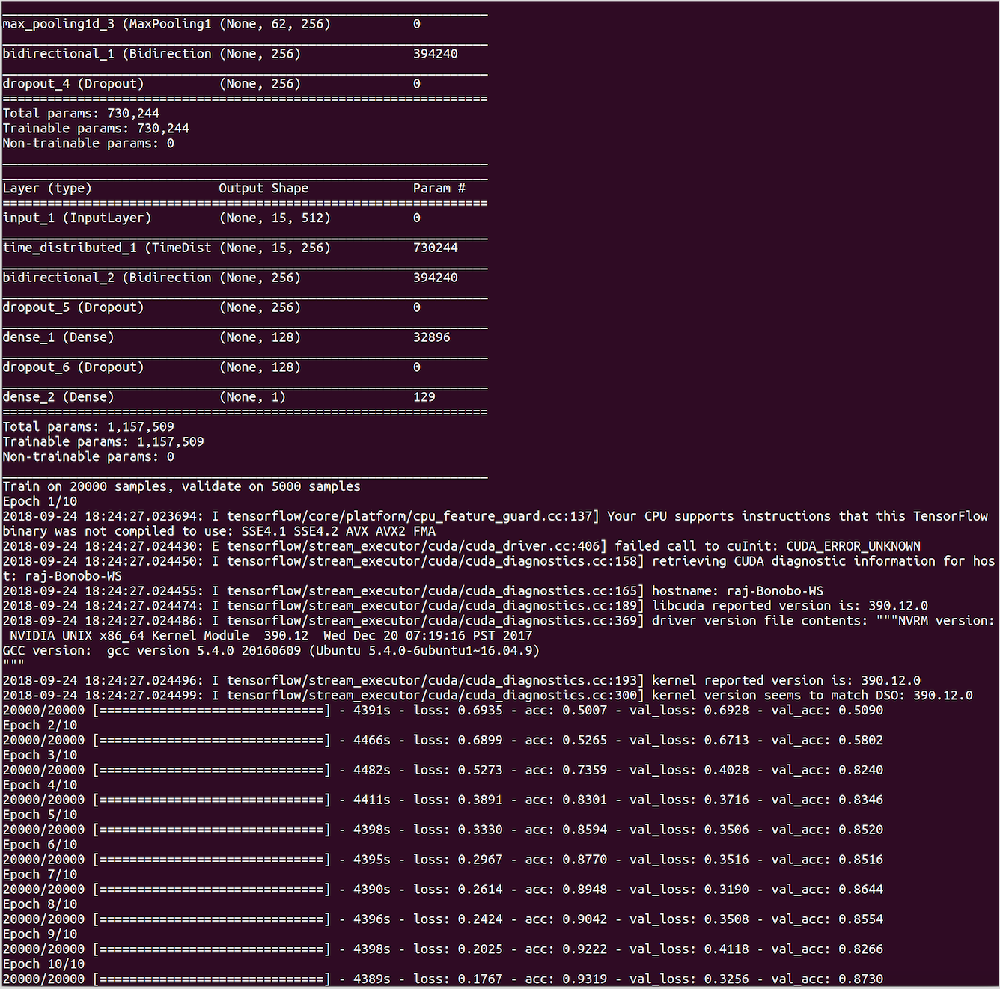

# Character Level Sentiment Models
## RNN-LSTM Models
These models are based on Karpathy's blog on the [The Unreasonable Effectiveness of Recurrent Neural Networks](http://karpathy.github.io/2015/05/21/rnn-effectiveness/) and Christopher Olah's blog on [Understanding LSTMs](https://colah.github.io/posts/2015-08-Understanding-LSTMs/).

The goal here is to encode text from character level, hence the we start by splitting the text (reviews in this case) into sentences. After encoding each sentence from characters to a fixed length encodingI use a bi-directional LSTM to read sentence by sentence and create a complete document encoding. The model starts reading characters and forming concepts of “words”, then uses a bi-directional LSTM to read “words” as a sequence and account for their position. After that each sentence encoding is being passed through a **second bi-directional LSTM that does the final document encoding**. The maximum length of the sentence is bound at 512 chars while the maximum number of sentences in a document is bound at 15. 

I have attempted two types of **CNN Sentence Encoders** here.  The first structure has 3 1DConvolution layers, with RELU nonlinearity, 1DMaxPooling and dropout. On top of that there is a **bidrectional LSTM which acts as the document encoder**. Run with -has_dense argument as False

An **alternative sentence encoder** is one that only uses convolutions and fully connected layers to encode a sentence. Here the network comprises of 2 streams of 3 convolutional layers that operate on different convolutional lengths, after that a temporal max pooling is performed and the 2 streams are concatenated to create a merged vector

The TimeDistributed layer is what allows the model to run a copy of the encoder to every sentence in the document. The final output is a sigmoid function that predicts 1 for positive, 0 for negative sentiment. Temporal max pooling helps in identifying those features that give a strong sentiment. The sentence encoder feeds it’s output to a document encoder that is composed of a bidirectional lstm with fully connected layers at the top.

The model is trained with a CNN/Bi-LSTM encoder on 20000 reviews and validating on 2500 reviews. The optimzer used is ADAM with the default parameters. The model roughly achieves ~87% accuarcy on the validation set after the first 10 epochs

## DataSet:

I have used the [IMDB Movies dataset from Kaggle](https://www.kaggle.com/c/word2vec-nlp-tutorial/data), labeledTrainData.tsv which contains 25000 reviews with labels

### Preprocessing on the Data:
I have done minimal preprocessing on the input reviews in the dataset following these basic steps:
1. Remove html tags
2. Replace non-ascii characters with a single space
3. Split each review into sentences

Then I create the character set with a max sentence length of 512 chars and set an upper bound of 15 for the max number of sentences per review.  The input X is indexed as (document, sentence, char) and the target y has the corresponding sentiments.

## Requirements:
- pandas 0.20.3
- tensorflow 1.4.0
- keras 2.0.8
- numpy 1.14.0

## Execution:
python char_runn.py -has_dense=True/False (default: True)

## Sample Output and Accuracy:
  

# Hierarchical Models with Attention
